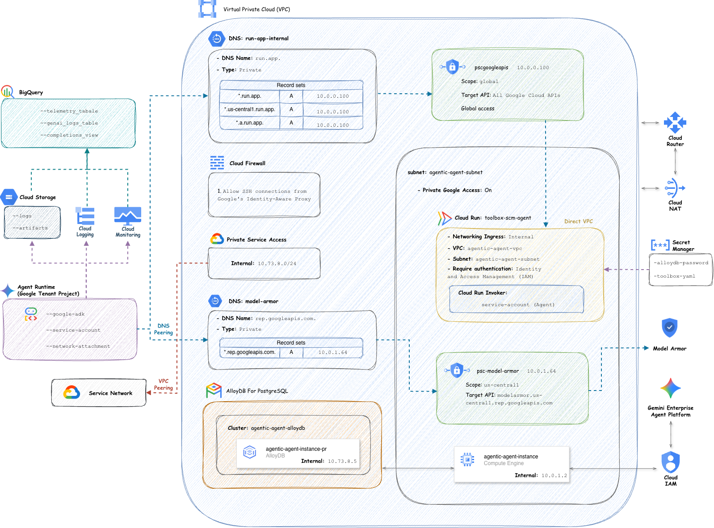

# Agentic Agent

An AI Customer Support Agent platform built with Google Agent Development Kit (ADK), Google Cloud Vertex AI Agent Runtime, AlloyDB (pgvector + hybrid search), Model Context Protocol (MCP) Toolbox, and Model Armor security guardrails.

---

## 🏛️ Architecture Overview



- **Agent Framework** ([`agent/`](agent)): Built on Google ADK (`google-adk`), wrapped in `AdkApp` for Vertex AI Reasoning Engine deployment.
- **Knowledge Retrieval**: Knowledge base articles stored in AlloyDB with multi-lingual embeddings (`text-multilingual-embedding-002`) and ScaNN vector indexing.
- **Tool Protocol**: Database queries orchestrated via Model Context Protocol (MCP) Toolbox hosted on Cloud Run.
- **Security & Guardrails**: Integrated [`ModelArmorPlugin`](agent/plugins/model_armor.py) for prompt sanitization, jailbreak prevention, and response verification.
- **Infrastructure as Code** ([`deployment/`](deployment)): Fully automated Terraform modules for multi-environment (`dev`, `staging`, `prod`) provisioning.

---

## 🚀 Getting Started

### Prerequisites

- **Python**: `>= 3.13`
- **Package Manager**: [`uv`](https://docs.astral.sh/uv/)
- **Google Cloud SDK**: [`gcloud`](https://cloud.google.com/sdk/docs/install) configured with Application Default Credentials (`gcloud auth application-default login`)

### Installation

Clone the repository and install dependencies using `uv`:

```bash
uv sync
```

---

## ⚙️ Environment Configuration

> [!IMPORTANT]
> **Always set `APP_ENV` before running any application commands or `Makefile` targets!**
>
> ```bash
> export APP_ENV=dev          # Options: dev, staging, prod
> ```
>
> The application uses **fail-fast validation**: if `APP_ENV` is missing or invalid, execution immediately halts to protect against unintended environment operations.

### Environment File Setup

Copy the template to your target environment file and fill in required values:

```bash
cp .env.example .env.dev
```

Key environment parameters:

| Variable | Description | Example Placeholder |
| :--- | :--- | :--- |
| `ROOT_MODEL` | Gemini LLM model identifier | `gemini-2.5-flash` |
| `GOOGLE_CLOUD_PROJECT` | Target GCP Project ID | `<YOUR_GCP_PROJECT_ID>` |
| `GOOGLE_CLOUD_LOCATION` | Target GCP Region | `<YOUR_GCP_REGION>` |
| `MODEL_ARMOR_TEMPLATE_ID` | Model Armor template ID | `<YOUR_MODEL_ARMOR_TEMPLATE_ID>` |
| `ALLOYDB_DATABASE` | Target AlloyDB database name | `<YOUR_ALLOYDB_DATABASE_NAME>` |
| `TOOLBOX_URI` | Cloud Run MCP Toolbox service endpoint | `https://<YOUR_TOOLBOX_SERVICE_URI>` |
| `AGENT_SERVICE_ACCOUNT` | Service account for Agent Runtime | `<YOUR_AGENT_SERVICE_ACCOUNT_EMAIL>` |
| `LOGS_BUCKET_NAME` | GCS bucket for runtime telemetry logs | `<YOUR_LOGS_BUCKET_NAME>` |
| `PSC_NETWORK_ATTACHMENT` | Private Service Connect attachment | `projects/<PROJECT_ID>/regions/<REGION>/networkAttachments/<ATTACHMENT_NAME>` |

---

## 🛠️ Makefile Commands

All Makefile targets automatically use the active `APP_ENV` configuration.

### 1. Verification

Verify active environment variables and project configuration:

```bash
export APP_ENV=dev
make verify-env
```

### 2. Local Agent Development (ADK Web UI)

Run the agent interactively with the ADK local web console:

```bash
export APP_ENV=dev
make run-agent
```

### 3. Local MCP Toolbox for Databases

Download and run the MCP Toolbox locally for testing database tools:

- **Download Toolbox binary** (macOS ARM64):
  ```bash
  make toolbox-dw
  ```
- **Run Toolbox CLI**:
  ```bash
  make toolbox
  ```
- **Run Toolbox Web UI**:
  ```bash
  make toolbox-ui
  ```
- **Run Toolbox on Custom Port (7000)**:
  ```bash
  make toolbox-port
  ```

### 4. Vertex AI Agent Engine Deployment

Deploy the agent to Google Cloud Vertex AI Agent Runtime:

- **Dry-Run Validation** (Validates configuration and OpenAPI schemas without cloud changes):
  ```bash
  export APP_ENV=dev
  make agent-deploy-dry
  ```

- **Deploy / Update Agent**:
  ```bash
  export APP_ENV=dev
  make agent-deploy
  ```

*(Under the hood, `make agent-deploy` generates `agent/utils/.requirements.txt` using `uv export` and executes `agent.utils.deploy` with idempotent create/update logic).*

---

## 📁 Repository Structure

```text
├── .cloudbuild/                 # Cloud Build CI/CD pipeline definitions
├── .env.example                 # Environment variables template
├── Makefile                     # Developer workflow and deployment commands
├── README.md                    # Root project documentation (this file)
├── images/                      # Architecture diagrams
├── pyproject.toml               # Python project configuration and dependencies
├── uv.lock                      # Locked dependency graph
├── manifests/                   # Static Vertex AI Agent Runtime manifests
│   ├── README.md                # Manifest schema & deployment guide
│   └── agent-manifest.example.yaml
├── agent/                       # Core Agent Application source code
│   ├── agent.py                 # ADK Agent definition & Toolset registration
│   ├── agent_runtime_app.py     # Vertex AI AdkApp runtime wrapper & telemetry
│   ├── prompt.py                # System instructions & knowledge base prompts
│   ├── guards/                  # Custom security guards
│   ├── plugins/                 # ADK plugins (e.g. ModelArmorPlugin)
│   ├── mcps/                    # MCP Toolbox YAML configurations per environment
│   └── utils/                   # Telemetry, typing, config, and deploy scripts
└── deployment/                  # Infrastructure as Code (Terraform)
    ├── README.md                # Infrastructure & AlloyDB bootstrap guide
    ├── environments/            # Per-environment Terraform root configs (dev, staging, prod)
    └── modules/                 # Modular Terraform components (VPC, AlloyDB, Cloud Run, etc.)
```

---

## 📚 Detailed Documentation

- 📖 [Infrastructure & AlloyDB Bootstrap Guide](deployment/README.md)
- 📖 [Vertex AI Manifest & Runtime Configuration](manifests/README.md)
